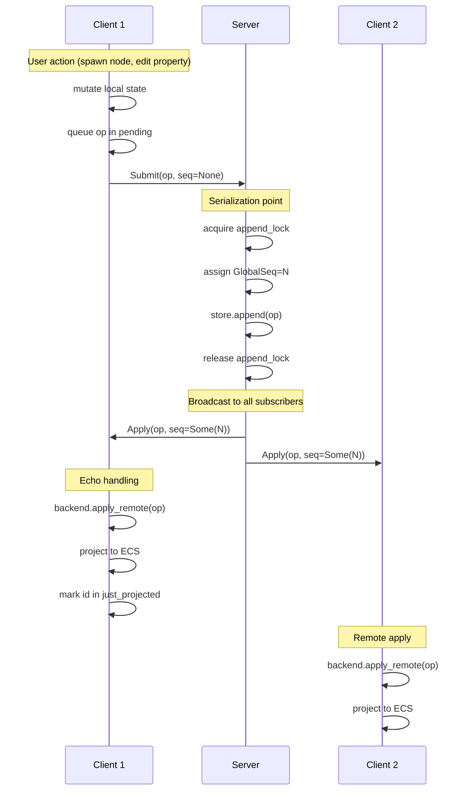
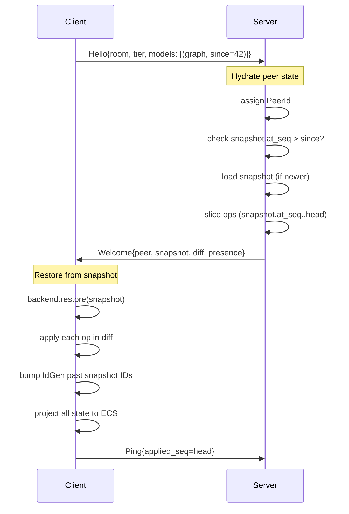

# CRDT stack — implementation overview

> **Status:** current. This document describes what is actually wired in
> the workspace today (post-refactor architecture as of commit `0acc1e8`).
> For the research/landscape (Fugue, Eg-walker, Loro, Yjs, P2P vs.
> server-mediated) and the original phased plan, see [`crdt.md`](system-design/crdt.md).
> For how the client app's external message bus sits *alongside* the CRDT
> sync layer, see [`event_bus.md`](event_bus.md). **If you're seeing
> references to `CrdtSyncPlugin` or "Phase X" and wondering what's legacy**,
> see [`architecture-evolution.md`](architecture-evolution.md).

## 1 · How to read this doc

This is the onboarding doc for someone who is about to add replicated
state to a kyoso app, write a new domain model, or understand why a sync
bug looks the way it does. It covers, in order:

- **§2** the substrate (`kyoso_crdt`): identity, ops, lattices, primitives, derives.
- **§3** the graph model (`kyoso_graph_crdt`): the first `CrdtModel` impl in the workspace.
- **§4** the ECS bridge (`kyoso_graph_sync`): how a Bevy component flows to and from the op log each frame.
- **§5** the transport (`kyoso_sync`): the multi-model WebSocket envelope.
- **§6** the server (`apps/kyoso_server`): rooms, append locks, snapshots, presence.
- **§7** three worked composition examples — adding a property, adding an edge category, adding a new model.
- **§8** presence vs. storage — what the split looks like as wired today.
- **§9** apps that consume the stack: `kyoso_client`, `kyoso_circuit_client`, `kyoso_loadgen`.
- **§10** known gaps and deferred decisions.
- **§11** pointer table.

### One-paragraph mental model

Each *room* has one totally-ordered op log per *model* (graph, comments,
…). Clients open one WebSocket per room; an [envelope][envelope]
multiplexes per-model traffic over that one socket. Locally-generated
ops accumulate in a per-model `pending` queue; an outbound system per
frame ships them to the server; the server stamps each op with a
monotonic [`GlobalSeq`][globalseq], appends to the log, and broadcasts
to every peer (including the originator). On every peer — including
the originator — the inbound system applies confirmed ops in `GlobalSeq`
order, then *projects* the resulting state back into the Bevy ECS. The
originator's local state is therefore not pre-applied; **visibility
waits one server round-trip**, which is the price the design pays to
keep CRDT semantics simple and `apply` idempotent.

## 1.5 · Comparison to existing systems

**vs Yjs**: Yjs uses P2P with vector clocks and yjsmod sequence CRDT; kyoso uses server-mediated total order with modular CRDT primitives. Choose Yjs for P2P networks where no central authority exists; kyoso for Figma-shaped collaborative editors with central coordination.

**vs Automerge**: Automerge preserves full history enabling fork/merge and time-travel; kyoso compacts aggressively for steady-state efficiency. kyoso's CrdtId-as-stable-id design keeps branching possible as future work without rewriting the core — see [`crdt.md §2.5`](system-design/crdt.md#25-branches--reconciliation-automerge-flavored) for the deferred branching strategy.

**vs Loro**: Both use Kleppmann movable trees + fractional indices for sibling order. Loro integrates Fugue for rich text; kyoso currently uses LWW strings (Fugue deferred per §10). Composition strategies align: both use lattice-based `Map<K, CRDT>` for nested properties.

**vs Operational Transformation (OT)**: CRDTs provide deterministic merge without transform functions; OT requires a central authority to serialize operations. Google Docs uses OT with massive infrastructure; kyoso's CRDT model is simpler to deploy and reason about at smaller scale, with the trade-off of round-trip latency for visibility.

For deeper background on the CRDT landscape — Fugue/Eg-walker text algorithms, tree CRDTs, graph replication policies, and composition — see [`crdt.md §2`](system-design/crdt.md#2--state-of-the-art-landscape-papers-libraries-what-changed-recently).

## 1.6 · Key operation sequences

Visual walkthroughs of the three critical flows.

### Op lifecycle: client → server → all peers



**Key insight**: The originator gets their own op echoed back with a `GlobalSeq`. Local mutations don't immediately update the authoritative backend state — visibility waits one round-trip. This keeps `apply` idempotent and CRDT semantics clean (§2.4.1, §3.3).

### Welcome handshake: snapshot + diff delivery



**Key insight**: Clients send their current cursor (`since`) per model. The server ships a snapshot if one exists newer than `since`, plus ops since the snapshot. Late joiners hydrate from compacted state rather than replaying the full history. The `bump IdGen` step (§2.1.1) prevents ID collisions with snapshot contents.

### Echo suppression: one-frame just_projected

Covered in detail at §4.3.1. The critical pattern: inbound projection marks entities so detection systems skip them the same frame, preventing loops.

### Crate map

| Crate | Role |
|---|---|
| [`kyoso_crdt`](../../../crates/kyoso_crdt/) | Model-agnostic primitives: identity, ops, lattice, wire format, envelope, protocol. |
| [`kyoso_crdt_derive`](../../../crates/kyoso_crdt_derive/) | `#[derive(Crdt)]` for schema structs (the *content* of a node). |
| [`kyoso_sync_derive`](../../../crates/kyoso_sync_derive/) | `#[derive(SchemaSync)]` for Bevy components (the *bridge* to the schema). |
| [`kyoso_graph`](../../../crates/kyoso_graph/) | In-memory graph/tree data structures, no networking. |
| [`kyoso_graph_crdt`](../../../crates/kyoso_graph_crdt/) | `CrdtModel` impl for the graph: ops, backend, snapshot, edge categories. |
| [`kyoso_graph_sync`](../../../crates/kyoso_graph_sync/) | The Bevy ECS ↔ graph CRDT bridge. |
| [`kyoso_sync`](../../../crates/kyoso_sync/) | The model-agnostic WebSocket transport plugin. |
| [`kyoso_comments_crdt`](../../../crates/kyoso_comments_crdt/) | `CrdtModel` impl for comments. |
| [`kyoso_comments_sync`](../../../crates/kyoso_comments_sync/) | Bevy plugin for the comments model. |
| [`apps/kyoso_server`](../../../apps/kyoso_server/) | Axum WebSocket coordinator. Owns the canonical op log per model per room. |
| [`apps/kyoso_client`](../../../apps/kyoso_client/) | Figma-shaped 2D editor binary. |
| [`apps/kyoso_circuit_client`](../../../apps/kyoso_circuit_client/) | 3D analogue circuit designer binary. |
| [`kyoso_loadgen`](../../../crates/kyoso_loadgen/) | Load-generation and chaos-testing binaries. |

---

## 2 · The substrate (`kyoso_crdt`)

### 2.1 Identity

Three id types do all the work, defined in [crates/kyoso_crdt/src/id.rs](../../../crates/kyoso_crdt/src/id.rs):

- `PeerId = u32` — assigned by the server on session start.
- `LocalSeq = u64` — per-peer monotonic counter.
- `GlobalSeq = u64` — server-assigned position in the totally-ordered op log.

A `CrdtId = (peer, seq)` ([id.rs:40](../../../crates/kyoso_crdt/src/id.rs#L40)) is collision-free without
coordination because the originator mints it locally under its own
`PeerId`. The same value identifies both an *op* and (for add-style
ops) the *element it creates* — `AddNode` doesn't carry a separate
"new node id" field because the op's own `CrdtId` is the node id.

`IdGen` ([id.rs:108](../../../crates/kyoso_crdt/src/id.rs#L108)) is the cloneable handle around an
`Arc<Mutex<IdGenerator>>`. **All CRDT models on the same peer share
one `IdGen`**, which is what makes cross-model references (e.g. a
comment's `anchor: CrdtId` pointing at a graph node) safe: every model
mints from one `LocalSeq` counter, so collisions are impossible.

Why this matters: there is no model tag on a `CrdtId`. A comment's
anchor is just a `CrdtId`; it could refer to a graph node, an edge, or
even another comment, and the typing comes entirely from context. The
shared `IdGen` is what lets the design get away with that.

**Why this design**: Sharing one `IdGen` across all models enables cross-model references without model tags or disambiguation. A comment's `anchor: CrdtId` can point to graph nodes, edges, or other comments — the typing comes entirely from context (the comment knows its anchor references a node). Lock contention on the `Arc<Mutex<IdGenerator>>` is negligible because minting happens in foreground engine systems only, not in hot async paths. The alternative — per-model counters with model tags on every ID — would bloat the wire format and complicate cross-model reference validation.

#### 2.1.1 Deep dive: The shared IdGen architecture

**Cross-model collision freedom**. All CRDT models on a peer (graph, comments, presence, future models) mint IDs from one `LocalSeq` counter. A `CrdtId = (peer, seq)` is globally unique across the entire peer's operation space. This lets a comment's `anchor: CrdtId` field safely reference a graph node's ID without carrying a model discriminator — the comment backend doesn't need to know the anchor points to a "graph node" vs "comment" vs "edge"; it's just an ID, and the graph model owns it.

**The `bump_to` mechanism** ([id.rs:146](../../../crates/kyoso_crdt/src/id.rs#L146)). When a peer restores from a snapshot containing IDs minted by this peer in a prior session, `IdGen::bump_to(max_seq + 1)` advances the counter past the snapshot's highest local ID. This prevents newly-minted IDs from colliding with snapshot contents. Example: snapshot contains nodes with IDs `(peer=5, seq=0..99)`. On restore, `bump_to(100)` ensures the next `IdGen::next()` returns `(5, 100)`, not `(5, 0)`. The `bump_to` logic is careful to preserve monotonicity when multiple models share the handle — if the graph has already minted `(5, 150)`, a comments snapshot with `(5, 120)` won't roll back to 121.

**Lock contention analysis**. `Arc<Mutex<IdGenerator>>` is cloned across every CRDT model on the peer. In practice, contention is negligible:
- ID minting happens in Bevy's `Update` schedule (foreground) when detection systems observe `Added<C>` or `Changed<C>` and emit ops. These run sequentially per model; at most one model is minting at a time.
- Async paths (WebSocket IO, HTTP handlers) never mint IDs — they only decode and apply remote ops.
- Measured lock hold time is ~100ns per `next()` call (increment + clone). A peer emitting 1000 ops/sec (unrealistic for a single user) spends 0.1ms/sec on ID generation.

The shared design also simplifies `Welcome` handling: one `PeerId` assignment updates all models' handles via `IdGen::set_peer(peer)` ([id.rs:139](../../../crates/kyoso_crdt/src/id.rs#L139)), which writes through the `Arc`.

### 2.2 Ops, log, and protocol

`Op<K> { id, seq, kind }` in [op.rs:21](../../../crates/kyoso_crdt/src/op.rs#L21) is the wire envelope: the
generic `K` is the model-specific op enum (e.g.
`kyoso_graph_crdt::OpKind`). `seq` is `None` while the op is pending
ack and `Some(GlobalSeq)` once the server has stamped it. `Diff<K>`
([op.rs:55](../../../crates/kyoso_crdt/src/op.rs#L55)) is a contiguous slice of the log used to ship history
on catch-up.

`InMemoryOpLog<K>` ([log.rs:48](../../../crates/kyoso_crdt/src/log.rs#L48)) is the default log implementation;
`append()` assigns `seq = head() + 1`. Sequences are 1-indexed so `0`
can mean "before the log".

The single-model protocol ([protocol.rs](../../../crates/kyoso_crdt/src/protocol.rs)) defines:

- `ClientMsg::Hello { room, since }` — joining handshake.
- `ClientMsg::Submit(Op<K>)` — outbound local op.
- `ClientMsg::Catchup { since }`, `Ping { applied_seq }`, `Presence(Vec<u8>)`, `LeavePresence`.
- `ServerMsg::Welcome { peer, snapshot, diff, presence }` — handshake reply.
- `ServerMsg::Apply(Op<K>)` — broadcast a stamped op.
- `ServerMsg::Catchup(Diff<K>)`, `Pong`, `Error`, `PresenceUpdate`, `PresenceLeft`.

Production paths use the **multi-model envelope** instead
([envelope.rs](../../../crates/kyoso_crdt/src/envelope.rs)): `EnvelopeClientMsg::Hello` carries a list
of `(ModelId, since)` so one socket joins multiple models in one
handshake; `Submit / Catchup / Ping / Apply / ApplyBatch / Catchup`
all tag their per-model payload with a `ModelId` so the receiver routes
to the matching handler. The `Tier` field
([envelope.rs:71](../../../crates/kyoso_crdt/src/envelope.rs#L71)) lets the server distinguish full-fidelity
`ReadWrite` peers (live per-op fanout, ~50ms p99) from observer-tier
`Read` peers (coalesced `ApplyBatch` fanout at ~250ms, 10× room
capacity).

### 2.3 The `Lattice` / `Crdt` trait pair

The algebraic backbone is two layered traits, in
[lattice.rs](../../../crates/kyoso_crdt/src/lattice.rs):

- `Lattice` ([lattice.rs:36](../../../crates/kyoso_crdt/src/lattice.rs#L36)) — a join-semilattice with bottom. `join`
  is associative, commutative, idempotent. These three axioms are the
  reason convergence works under arbitrary message reordering and
  duplication.
- `Crdt: Lattice` ([lattice.rs:76](../../../crates/kyoso_crdt/src/lattice.rs#L76)) — adds a typed `Mutation`
  (intent — "set name to X") and `Delta` (wire-shippable, idempotent
  record of one change). The contract on `apply` is **idempotent**:
  applying the same delta twice is a no-op.

`DeltaError` ([lattice.rs:99](../../../crates/kyoso_crdt/src/lattice.rs#L99)) names the four ways an apply can
fail (`TypeMismatch`, `UnknownPath`, `Invalid`, `MissingPredecessor`)
— distinct from `ApplyError` ([model.rs:31](../../../crates/kyoso_crdt/src/model.rs#L31)) which models
*ordering* failures at the op-log level (`Unconfirmed`, `OutOfOrder`).

### 2.4 Causal context

A subtle but load-bearing piece. CRDTs need *fresh, unique* tags for
some operations (an OR-Set add needs a unique add-dot; a PN-Counter
needs a replica id). Rather than mint a new id from scratch and ship
it on the wire, every embedded CRDT derives its identity from the
*outer* op's `CrdtId + GlobalSeq` at apply time.

`Dot = CrdtId` ([context.rs:29](../../../crates/kyoso_crdt/src/context.rs#L29)). `SubDot { op, sub: u32 }`
([context.rs:35](../../../crates/kyoso_crdt/src/context.rs#L35)) is `(parent_op_id, counter)`, globally unique
because `parent_op_id` already is.

`CausalContext<'a>` ([context.rs:85](../../../crates/kyoso_crdt/src/context.rs#L85)) is the borrowed
view passed into `apply` (read-only) and `mutate` (read-write — embedded
CRDTs allocate sub-dots via `fresh_sub_dot()`). The persistent state
behind it is `CausalState` ([context.rs:60](../../../crates/kyoso_crdt/src/context.rs#L60)), a `HashMap<Dot, u32>`
of per-op sub-counters living on the backend.

**Consequence**: `WireDelta` carries no timestamps and no per-element
tags. The LWW stamp, the OR-Set add-tag, the PN-Counter replica are
*all* derived at the receiving end from the outer op's identity. See
the comment in [delta.rs:96–104](../../../crates/kyoso_crdt/src/delta.rs#L96-L104).

**Wire efficiency**: SubDots are derived from the outer op's identity rather than minted fresh and transmitted. This means `WireDelta` carries no timestamps — the LWW stamp, OR-Set add-tag, and PN-Counter replica are all computed at apply time from `CausalContext`. Only data the outer op cannot supply (dynamic positions in `SequenceInsert`, observed-sets in `OrSetRemove`) lives in the delta. This saves ~16 bytes per embedded CRDT operation (would be `(peer: u32, seq: u64, sub: u32)` if transmitted) and makes the wire format denser under postcard's varint encoding.

#### 2.4.1 Deep dive: Causal context & SubDot derivation

**The identity inheritance pattern**. Every CRDT op on the wire has an outer `Op<K> { id: CrdtId, seq: Option<GlobalSeq>, kind: K }`. When that op is applied, the `apply` function receives a `CausalContext<'a>` containing `{ op_id: CrdtId, seq: Option<GlobalSeq>, state: &mut CausalState }`. Embedded CRDTs (properties on a node, elements in an OR-Set, entries in a CausalMap) derive their identity from that context rather than carrying it in the delta.

**Concrete examples**:

- **OR-Set add** ([or_set.rs:103](../../../crates/kyoso_crdt/src/types/or_set.rs#L103)). The mutation `OrSetMut::Add(value)` produces `OrSetDelta::Add(value)` (no tag field). On apply, `OrSet::apply` calls `ctx.fresh_sub_dot()` to allocate `SubDot { op: ctx.op_id, sub: 0 }` and associates it with `value`. The wire delta is `OrSetAdd { value: postcard::to_vec(&value) }` — the tag is derived on receipt, not transmitted.
  
- **LWW write** ([lww.rs:56](../../../crates/kyoso_crdt/src/types/lww.rs#L56)). The mutation `LwwMut::Set(val)` produces `LwwDelta::Replace(val)`. On apply, the LWW register's internal `(value, seq, peer)` stamp is set to `(val, ctx.seq.unwrap(), ctx.op_id.peer)`. Wire delta: `LwwReplace { value: Vec<u8> }` — no `(seq, peer)` fields, because `CausalContext` provides them.
  
- **PN-Counter increment** ([pn_counter.rs:67](../../../crates/kyoso_crdt/src/types/pn_counter.rs#L67)). The delta carries `PnCounterDelta { by: i64 }`. On apply, the counter updates `self.pos.entry(ctx.op_id.peer).and_modify(|v| *v += by)` (if `by > 0`) or `self.neg` (if `by < 0`). The replica ID is `ctx.op_id.peer`, not transmitted in the delta.

**What lives in WireDelta vs CausalContext**:

| Data | Where | Example |
|---|---|---|
| Element value | `WireDelta` | `OrSetAdd { value }`, `LwwReplace { value }` |
| Unique tag / stamp | `CausalContext` (derived) | OR-Set add-tag = `(ctx.op_id, sub: 0)` |
| Replica ID | `CausalContext` (derived) | PN-Counter replica = `ctx.op_id.peer` |
| Observed dots (for remove) | `WireDelta` | `OrSetRemove { observed: Vec<SubDot> }` (must be explicit) |
| Position (for sequence insert) | `WireDelta` | `SequenceInsert { predecessor: Option<SubDot>, value }` |

The rule: if the outer op's `(peer, seq)` can deterministically derive it, don't transmit it. If it's dynamic (observed-set, fractional-index predecessor), put it in the delta.

**Why this works**. Server-mediated total order guarantees every peer applies ops in the same `GlobalSeq` sequence. When peer A and peer B both apply op `(peer=3, seq=42)`, they both construct `CausalContext { op_id: (3, 42), seq: Some(N), ... }` with the same outer identity. Embedded CRDTs call `ctx.fresh_sub_dot()` in a deterministic code path (e.g., OR-Set `apply` always allocates `sub=0` for the first add), so they mint the same `SubDot { op: (3, 42), sub: 0 }` on every replica. No coordination needed — the derivation is a pure function of the op's identity and the apply logic's structure.

### 2.5 The wire delta and path addressing

One uniform on-the-wire shape — `WireDelta` ([delta.rs:106](../../../crates/kyoso_crdt/src/delta.rs#L106)) — with
variants for each base CRDT:

```
LwwReplace { value: Vec<u8> }
OrSetAdd   { value: Vec<u8> }
OrSetRemove { observed: Vec<SubDot> }
PnCounterDelta { by: i64 }
SequenceInsert { predecessor: Option<SubDot>, value: Vec<u8> }
SequenceDelete { targets: Vec<SubDot> }
MapPut    { key: PathSegment, inner: Box<WireDelta> }
MapRemove { key: PathSegment, observed: Vec<SubDot> }
```

A `Path` ([delta.rs:33](../../../crates/kyoso_crdt/src/delta.rs#L33)) is a list of `PathSegment::Field(String)` or
`PathSegment::Key(String)` and addresses *where* in a nested schema the
delta lands (e.g. `["style", "fill"]`).

Dispatch is the `SchemaApply` trait ([schema.rs:39](../../../crates/kyoso_crdt/src/schema.rs#L39)): an
implementation walks `path` through the struct's named fields and
converts the wire variant into the leaf CRDT's typed delta. The
`#[derive(Crdt)]` macro generates this impl.

The cycle for a property mutation looks like:

```
typed mutation  ─►  S::Mutation  ─► S::Delta  ─►  (Path, WireDelta)
                                                       │
                                  wire transit          ▼
                                                  OpKind::SetNodeProperty {
                                                    target: node_id, path, delta
                                                  }
                                                       │
                                                       ▼
                                          S::apply_wire(path, delta, ctx)
```

### 2.6 Base CRDT primitives

In [crates/kyoso_crdt/src/types/](../../../crates/kyoso_crdt/src/types/):

| Primitive | Convergence | Use for |
|---|---|---|
| [`LwwRegister<T>`](../../../crates/kyoso_crdt/src/types/lww.rs) | `(GlobalSeq, PeerId)` LWW; stamp derived at apply | Transforms, names, scalar enums — anywhere "later wins" is fine. |
| [`OrSet<T>`](../../../crates/kyoso_crdt/src/types/or_set.rs) | Add-wins; remove only targets *observed* dots | Tags, labels, any add-wins set. |
| [`PnCounter`](../../../crates/kyoso_crdt/src/types/pn_counter.rs) | Per-peer `pos`/`neg` `HashMap<PeerId, u64>`, pointwise max | Counters where concurrent ±1s should sum. |
| [`CausalMap<V: Crdt>`](../../../crates/kyoso_crdt/src/types/causal_map.rs) | Pointwise join over key | `HashMap<String, V>` where `V` itself is a CRDT. The central composition combinator. |
| [`Sequence<T>`](../../../crates/kyoso_crdt/src/types/sequence.rs) | **Naive `Vec`-backed stub** — single-writer safe only | Placeholder for `#[crdt(sequence)]` fields. Real Fugue/Eg-walker impl is future work; see §10. |

Each impl provides `Crdt` + `Lattice` + `SchemaApply` + `From<TypedDelta> for WireDelta` + `TryFrom<WireDelta> for TypedDelta`, all property-tested for the lattice axioms.

### 2.7 The `CrdtModel` trait

[model.rs:43](../../../crates/kyoso_crdt/src/model.rs#L43). The single abstraction every replicated data
structure implements. Two associated types — `OpKind` (the per-model op
enum) and `State` (the snapshot type) — plus seven methods covering the
lifecycle:

- `set_peer(peer)` — set on Welcome.
- `applied_seq()` — for liveness / GC.
- `apply_remote(op)` — idempotent apply, returns `ApplyError::OutOfOrder` if the op's seq doesn't match the expected high-water mark.
- `snapshot() / restore(snap)` — compaction + recovery.
- `drain_pending() -> Vec<Op<OpKind>>` — outbound side; the transport calls this each tick.
- `op_kind_label(op) -> &'static str` — for telemetry.

The graph and comments models both implement this trait; **a third model is a few hundred lines of code** thanks to the shared substrate.

### 2.8 Derive macros

Two procedural macros do the bulk of the per-domain glue work.

**`#[derive(Crdt)]`** ([kyoso_crdt_derive/src/lib.rs](../../../crates/kyoso_crdt_derive/src/lib.rs)) on a struct of CRDT-typed fields:

```rust
#[derive(Crdt)]
pub struct FrameSchema {
    pub name: LwwRegister<String>,
    pub tags: OrSet<String>,
    pub edit_count: PnCounter,
}
```

generates:

- `FrameSchemaMut` — a sum type with one variant per field carrying that field's `Crdt::Mutation`.
- `FrameSchemaDelta` — the same shape over `Crdt::Delta`.
- `impl Lattice` — pointwise join over fields.
- `impl Crdt` — typed `apply` / `mutate` that dispatches by variant.
- `impl SchemaApply` — wire-driven dispatch by the head `Path` field name.

**`#[derive(SchemaSync)]`** ([kyoso_sync_derive/src/lib.rs](../../../crates/kyoso_sync_derive/src/lib.rs)) on a Bevy component:

```rust
#[derive(Component, Default, Clone, PartialEq, SchemaSync)]
#[schema(name = "Frame")]
pub struct Frame {
    pub name: String,
    pub visible: bool,
    #[crdt(or_set)]    pub tags: Vec<String>,
    #[crdt(counter)]   pub edit_count: i64,
    #[crdt(skip)]      pub local_hover: HoverState,
}
```

generates `FrameSchema` (with each field wrapped in the appropriate CRDT
primitive — `LwwRegister<String>` for `name`, `OrSet<String>` for `tags`,
`PnCounter` for `edit_count`), an impl of `SchemaSync` that knows how to
`changes_against` an existing schema state (producing a list of
mutations) and how to `write_back` a schema state to the Bevy component.
Per-field attributes:

| Attribute | Schema type | Behaviour |
|---|---|---|
| (default) / `#[crdt(lww)]` | `LwwRegister<T>` | Echo-guards against `Self::default()`. |
| `#[crdt(or_set)]` | `OrSet<T>` (from `Vec<T>` / `HashSet<T>`) | Set-diff: add new, remove missing. |
| `#[crdt(counter)]` | `PnCounter` | Inc / Dec by signed diff. |
| `#[crdt(map)]` | `CausalMap<LwwRegister<V>>` | Per-key apply / remove. |
| `#[crdt(nested)]` | `<T as SchemaSync>::Schema` | Delegate to inner type's `SchemaSync`. |
| `#[crdt(with = "Type")]` | the named `Type` | Escape hatch: `Type: SchemaField`. |
| `#[crdt(sequence)]` | `Sequence<char>` or `Sequence<T>` | Prefix-suffix diff. **Stub** — see §10. |
| `#[crdt(skip)]` | — | Field not replicated. |
| `#[crdt(rename = "x")]` | — | Override the wire field name. |

The pair is the surface most contributors will touch.

---

## 3 · The graph model (`kyoso_graph_crdt`)

The first concrete `CrdtModel` impl. Its job: replicate a node + edge
topology with a tree-overlay structure, plus typed per-node properties.

### 3.1 The op kinds

[op.rs](../../../crates/kyoso_graph_crdt/src/op.rs):

```rust
pub enum OpKind {
    AddNode,                                                    // id = enclosing op's CrdtId
    RemoveNode { target: CrdtId },
    Move { target: CrdtId,
           new_parent: Option<CrdtId>,
           position: String },                                  // OrderKey, fractional index
    AddRefEdge { category: EdgeCategory, from: CrdtId, to: CrdtId },
    RemoveRefEdge { target: CrdtId },
    SetNodeProperty { target: CrdtId, path: Path, delta: WireDelta },
    SetRefEdgeProperty { target: CrdtId, path: Path, delta: WireDelta },
}
```

`AddNode` / `AddRefEdge` reuse the enclosing op's `CrdtId` as the new
element's id — there is no separate "new id" field. Removes are
tombstones (with cascade for incident reference edges), not deletions,
so late-arriving `AddRefEdge` ops referencing a removed node can be
detected and skipped deterministically.

### 3.2 Two distinct edge kinds

**Tree edges** are not a separate `OpKind`. The parent-child scaffold
lives as an annotation on nodes (`TreeParent`, `OrderKey`) and is
replicated through the atomic [`Move`][move-op] op:

- Reparent and reorder in one op.
- Cycle detection at apply time — the op is no-op'd rather than
  rejected (deterministic under server total order — every replica
  reaches the same accept/reject decision).
- `position` is a fractional-index string (`OrderKey`) — concurrent
  inserts at the same sibling position interleave by string compare.

This is the Kleppmann atomic-tree-move algorithm, simplified by the
fact that the server total-orders everything: peers don't have to
undo-and-redo speculative moves on out-of-order delivery because there
*is* no out-of-order delivery.

**Reference edges** are first-class entities. Each has a category
([edge_category.rs:29](../../../crates/kyoso_graph_crdt/src/edge_category.rs#L29)):

```
Reference            // default for untyped edges
InstanceOf           // Figma: component instance → main
PrototypeLink        // Figma: prototype transition
ConstraintPin
StyleRef
CommentAnchor
Mention
MaskOf
Custom(String)       // app-defined
```

Phase E treats the category as metadata. The `RefEdgeCrdt` trait
([edge_category.rs:123](../../../crates/kyoso_graph_crdt/src/edge_category.rs#L123)) is the hook for future per-category divergence
(different `RefEdgePolicy` — `OrSet` / `TwoPSet` / `RemoveWins` /
`LwwByEndpoints` — and `DanglePolicy` — `Cascade` / `Tolerate` /
`ReanchorOnUndo`). At the moment every category uses the same
remove-by-tombstone shape with `DanglePolicy::Cascade`.

### 3.3 The backend

[`CrdtBackend<N, E>`](../../../crates/kyoso_graph_crdt/src/backend.rs) is the storage type. Internally:

- `nodes: HashMap<CrdtId, NodeRecord>` — `(tombstoned, order_key, tree_parent, properties: HashMap<String, Vec<u8>>)`.
- `edges: HashMap<CrdtId, EdgeRecord>` — `(from, to, category, tombstoned, properties)`.
- `pending: Vec<Op<OpKind>>` — locally generated, not yet ack'd.
- `pending_moves: HashMap<CrdtId, CrdtId>` — `op_id → target_node_id` for in-flight moves so the detection systems can answer "is this entity awaiting a Move echo?" without reading a pre-applied `tree_parent`.
- `applied_seq: GlobalSeq` — high-water mark.
- `ids: IdGen` — *cloneable handle*, typically shared with every other CRDT model on the peer.

Mutating methods (`add_node`, `remove_node`, `add_edge`, `add_ref_edge_with_category`, `move_node`, etc.) **mint a `CrdtId` from `ids` and queue an `Op<OpKind>` in `pending`**. They do *not* update the backend's authoritative `nodes` / `edges` state. That update only happens when the server echo comes back through `apply_remote` ([backend.rs:469](../../../crates/kyoso_graph_crdt/src/backend.rs#L469)).

Exception: `AddNode` *can* be pre-applied because `or_insert` makes the
echo idempotent ([document.rs:148](../../../crates/kyoso_graph_crdt/src/document.rs#L148)). But mutations on existing state
are not pre-applied, because:

- `PnCounter` would double-count (the local apply and the echo both add).
- `LWW` stamps with `seq = None` compare "always loses to a confirmed
  op" — bad behaviour under interleaving with a concurrent remote op.
- `Sequence` would insert twice.

The decision is documented in detail at [document.rs:70–90](../../../crates/kyoso_graph_crdt/src/document.rs#L70).

The trade-off: one server round-trip of staleness per mutation. Apps
that want optimistic UI keep their own local shadow state — Bevy ECS
components are a natural fit — and re-sync when the echo arrives.

**The no-pre-apply decision**: Local mutations queue in `pending` but don't update the authoritative state until the server echo arrives. Counter-intuitive for UX (users expect instant feedback), but essential for correctness:

1. **PN-Counter would double-count**: If `mutate_property` pre-applied `PnCounterMut::Inc(1)`, the backend would increment `pos[peer] += 1` locally. When the echo arrives, `apply_remote` would apply the same delta again → `pos[peer] += 1` a second time. Final state: `+2` instead of `+1`.

2. **LWW stamps with `seq=None` lose to concurrent remote ops**: During mutation, the op hasn't been stamped yet (`seq = None`). The LWW comparison logic is `(seq_a, peer_a) > (seq_b, peer_b)` where `None < Some(N)` for any `N`. If a concurrent remote op with `seq=Some(42)` arrives between local mutation and echo, it would overwrite the pre-applied local value, then the echo would restore it → non-deterministic outcome depending on network timing.

3. **Sequence would insert twice**: `SequenceInsert { predecessor, value }` would insert `value` after `predecessor` during mutation, then again during echo → duplicate element.

The `AddNode` exception ([document.rs:148](../../../crates/kyoso_graph_crdt/src/document.rs#L148)): `nodes.entry(id).or_insert(...)` is idempotent — applying the same `AddNode` twice is a no-op because the `or_insert` only writes if the key is missing. This lets the detection layer pre-spawn Bevy entities immediately for responsive UX, knowing the echo won't corrupt state.

For detailed analysis of the pathologies that drove this choice, see [document.rs:70–90](../../../crates/kyoso_graph_crdt/src/document.rs#L70).

### 3.4 Schema-aware document

[`Document<S>`](../../../crates/kyoso_graph_crdt/src/document.rs) is the schema-typed sibling to `CrdtBackend`.
Where `CrdtBackend` stores per-property bytes (`HashMap<String, Vec<u8>>`),
`Document<S>` stores a typed `S` (a `#[derive(Crdt)]` schema struct) per node and routes inbound `SetNodeProperty` ops through `S::apply_wire`. The two layers coexist; the typed-component plugin layer in `kyoso_graph_sync` always uses `Document<S>`.

**Confused about CrdtBackend vs Document?** See [`backend-vs-document.md`](backend-vs-document.md) for a detailed explanation of why both exist, how they relate, and when to use which. TL;DR: `CrdtBackend` handles structure (tree, edges) + simple LWW properties; `Document<S>` handles typed CRDT properties (OR-Set, PN-Counter, nested maps).

### 3.5 Snapshots

[`Snapshot`](../../../crates/kyoso_graph_crdt/src/snapshot.rs) is the materialised converged state at a `GlobalSeq`:

```
Snapshot { at_seq,
           nodes: Vec<NodeSnap { id, order_key, tree_parent, properties }>,
           edges: Vec<EdgeSnap { id, from, to, category, properties }> }
```

Tombstones are excluded — the snapshot only contains live state. That
is what makes compaction safe: once a snapshot at seq `N` exists *and*
every connected peer's `applied_seq >= N`, the server can drop log ops
below `N`. Late joiners get the snapshot in their `Welcome`, then the
diff since.

`apply_remote` restores `IdGen::next_seq` past the highest local seq in
the snapshot ([backend.rs:341](../../../crates/kyoso_graph_crdt/src/backend.rs#L341)), so newly-minted IDs after a restore can't
collide.

---

## 4 · The ECS ↔ CRDT bridge (`kyoso_graph_sync`)

The bridge is where the graph model meets Bevy. It's where most
new-contributor confusion lives, so this section is long.

### 4.1 Plugin layout

`GraphSyncPlugin<N, E>` ([plugin.rs:88](../../../crates/kyoso_graph_sync/src/plugin.rs#L88)) is the top-level Bevy plugin. It is generic over two marker components — `N` for nodes, `E` for edges — that consuming apps choose (e.g. `FigmaNode` / `FigmaEdge` or `CircuitNode` / `CircuitEdge`).

`build()` ([plugin.rs:124](../../../crates/kyoso_graph_sync/src/plugin.rs#L124)) installs:

- `ModelRegistry` (resource) + the graph model id pushed into it.
- `PeerIdGen` (resource) — the shared `IdGen` handle.
- `ClientSyncEngine` (resource) — a Bevy-side wrapper around `CrdtBackend<(), ()>`.
- `EntityCrdtIndex` (resource) — the bidirectional `Entity ↔ CrdtId` map.
- `RemoteOpApplied` (event) — emitted per confirmed op, consumed by typed schema and edge category plugins.
- `GraphLastAck` (resource) — last applied seq we sent as a Ping.

Then chains **seven systems** in `Update` ([plugin.rs:153](../../../crates/kyoso_graph_sync/src/plugin.rs#L153)):

```
graph_inbound_system
  → detect_added_nodes
  → detect_added_edges
  → detect_tree_position_changes
  → detect_removed_nodes
  → detect_removed_edges
  → outbound_system
```

Each frame, inbound runs first (network → ECS), then detection (ECS →
op queue), then outbound (op queue → network + ack).

### 4.2 The Entity ↔ CrdtId index

[`EntityCrdtIndex`](../../../crates/kyoso_graph_sync/src/index.rs) maps `Entity ↔ CrdtId` in both directions for both nodes and edges. Detection systems consult `node_id(entity)` to find the CRDT id for the entity they're emitting an op against; the inbound projector consults `entity_for_node(id)` to find (or create) the entity for an incoming op.

### 4.3 The `ClientSyncEngine` and echo suppression

[`ClientSyncEngine`](../../../crates/kyoso_graph_sync/src/engine.rs) wraps the `CrdtBackend` for Bevy. It is the same backend logic with two additions:

- A `just_projected: HashSet<CrdtId>` set ([engine.rs:45](../../../crates/kyoso_graph_sync/src/engine.rs#L45)) — op IDs the inbound projector applied this frame. Detection systems skip entities whose `CrdtId` is in this set, which is how the originator doesn't re-emit the op they just got an echo for.
- A `Bevy Resource` impl — so the engine can be inserted as one.

The set is cleared each frame; the discipline is "if you just spawned
an entity from an inbound op, mark its id so the next system in the
chain doesn't observe it as a `Added<C>` and emit an outbound op for
it."

**Why one-frame suppression works**: Detection systems run *after* projection in the system chain (see §4.1). An entity projected from an inbound op this frame will be seen by detection as `Added<C>` (Bevy's change detection fires on spawn), but its `CrdtId` is in `just_projected` so the detection system skips it. Next frame the set is cleared, but the entity is no longer `Added<C>` (Bevy's `Added<T>` filter only fires for one frame after spawn), so detection never emits an op for it. This simple one-frame window prevents echo loops without complex bookkeeping or persistent "already synced" markers.

#### 4.3.1 Deep dive: Echo suppression & detection systems

**The just_projected HashSet pattern**. Inbound projection (§4.5) and detection (§4.4) run in the same `Update` schedule chain, with projection first:

```
graph_inbound_system           // drains WsInbound, applies ops, projects to ECS
  → detect_added_nodes          // sees Added<N>, emits AddNode
  → detect_added_edges          // sees Added<EdgeFrom>, emits AddRefEdge
  → detect_tree_position_changes // sees Changed<TreeParent>, emits Move
  → detect_removed_nodes        // sees RemovedComponents, emits RemoveNode
  → detect_removed_edges        // sees RemovedComponents, emits RemoveRefEdge
  → outbound_system             // drains pending, sends to server
```

Every projected entity's `CrdtId` is added to `ClientSyncEngine::just_projected` ([engine.rs:45](../../../crates/kyoso_graph_sync/src/engine.rs#L45)). Detection systems consult this set via `EntityCrdtIndex::node_id(entity)` and skip any entity whose ID is present. The set is cleared at the start of the next `Update` tick.

**Concrete example walkthrough**:

1. **Frame N**: User spawns a Bevy entity `E` with component `FigmaNode`. Bevy's `Added<FigmaNode>` filter will fire next frame.

2. **Frame N**: `detect_added_nodes` sees `Added<FigmaNode>` on `E`, looks up or mints a `CrdtId`, emits `OpKind::AddNode`. The op is queued in `pending` with `seq=None`.

3. **Frame N**: `outbound_system` drains `pending`, sends `Submit(AddNode)` to the server.

4. **Frame N+k** (after network round-trip): Server broadcasts `Apply(AddNode, seq=Some(42))` back to this client.

5. **Frame N+k**: `graph_inbound_system` receives the echo, decodes it, calls `engine.apply_remote(op)` (which applies to backend via idempotent `or_insert`), then projects:
   - Checks `EntityCrdtIndex::entity_for_node(id)` → finds `E` (already exists).
   - Skips spawn (entity already present).
   - Marks `id` in `just_projected`.

6. **Frame N+k**: `detect_added_nodes` runs. Bevy's `Added<FigmaNode>` filter does *not* fire for `E` (it only fires the frame after spawn, which was frame N). Query sees nothing → no op emitted.

Alternative scenario: **remote** `AddNode` arrives first (before local spawn):

1. **Frame M**: `graph_inbound_system` receives `Apply(AddNode, seq=Some(42))` from a remote peer.
2. **Frame M**: Inbound projects: spawn entity `E'` with `FigmaNode::default()`, bind in index, mark `id` in `just_projected`.
3. **Frame M**: `detect_added_nodes` sees `Added<FigmaNode>` on `E'`, looks up `id` via index → finds it in `just_projected` → skips.
4. **Frame M**: `outbound_system` does nothing (pending queue empty).
5. **Frame M+1**: `just_projected` cleared. `E'` is no longer `Added<FigmaNode>` (Bevy's filter is one-frame), so detection ignores it.

**Why this works**. The one-frame suppression window aligns with Bevy's change-detection semantics:
- `Added<C>` fires exactly once, the frame after spawn.
- Projection and detection run in the same frame, with projection first.
- If projection spawned `E`, detection sees `Added<C>` but `id ∈ just_projected` → skip.
- Next frame: `just_projected` cleared, but `Added<C>` no longer fires → detection ignores `E`.

No persistent "synced" markers needed. No multi-frame tracking. Just one HashSet, populated by projection and consulted by detection, cleared each tick.

### 4.4 The detection systems

These are local-to-network. Each watches a specific Bevy query and
emits the corresponding op into the engine's pending queue:

- `detect_added_nodes::<N, E>` — `Added<N>` → `OpKind::AddNode`.
- `detect_added_edges::<N, E>` — `Added<EdgeFrom>` + `Added<EdgeTo>` (with `E` marker, without `TreeEdge` marker) → `OpKind::AddRefEdge { category: Reference, ... }`. Typed-category plugins (§4.6) run *before* this and bind their own categories first.
- `detect_tree_position_changes::<N, E>` — `Changed<TreeParent>` or `Changed<OrderKey>` → `OpKind::Move`. Skips entities already in `pending_moves`.
- `detect_removed_nodes::<N, E>` and `detect_removed_edges::<N, E>` — Bevy `RemovedComponents` → `OpKind::RemoveNode` / `RemoveRefEdge`.

None of them write to ECS state. They write to the engine's `pending`
queue and the index.

### 4.5 The inbound projector

`graph_inbound_system` ([plugin.rs:178](../../../crates/kyoso_graph_sync/src/plugin.rs#L178)) reads `WsInbound` Bevy events (emitted by the transport plugin in `PreUpdate`), filters for graph traffic, decodes each payload, calls `engine.apply_remote(&op)`, then projects the op into ECS:

- `AddNode` → spawn entity with `N::default()`, bind in `EntityCrdtIndex`.
- `AddRefEdge` → spawn entity with `EdgeFrom`/`EdgeTo`/`E::default()`, then `commands.queue(ApplyEdgeCategory { entity, category })` to insert the matching marker if any plugin registered one.
- `Move` → update `TreeParent` and `OrderKey` on the target entity.
- `RemoveNode` / `RemoveRefEdge` → despawn entity.
- `SetNodeProperty` / `SetRefEdgeProperty` → no direct ECS write; emit `RemoteOpApplied` so the typed-schema layer (§4.7) routes it to a `Document<S>` and writes back to the Bevy component.

Each projected op's id is added to `just_projected` so the detection
systems running afterwards skip the new entity.

`Welcome { snapshot, diff }` is handled here too: snapshot is restored
into the engine (which bumps `IdGen`), then every diff op is applied
and projected as if it had arrived as `Apply`.

### 4.6 Typed edge categories

`SyncedEdgeCategoryPlugin<N, E, M>` ([category.rs:82](../../../crates/kyoso_graph_sync/src/category.rs#L82)) is what wires a per-category marker component:

```rust
#[derive(Component, Default, Debug, Clone)]
struct InstanceOfEdge;
impl EdgeCategoryMarker for InstanceOfEdge {
    fn category() -> EdgeCategory { EdgeCategory::InstanceOf }
}

app.add_plugins(SyncedEdgeCategoryPlugin::<MyNode, MyEdge, InstanceOfEdge>::default());
```

The plugin:

- Registers `M` in `EdgeCategoryProjectors` ([category.rs:62](../../../crates/kyoso_graph_sync/src/category.rs#L62)) — a `HashMap<String, fn(&mut World, Entity)>` keyed by the debug string of the category.
- Adds `detect_added_categorized_edges::<E, M>` ([category.rs:139](../../../crates/kyoso_graph_sync/src/category.rs#L139)) *before* the generic `detect_added_edges` — so a spawn with `(EdgeFrom(a), EdgeTo(b), MyEdge, InstanceOfEdge)` produces `AddRefEdge { category: InstanceOf, ... }` rather than the default `Reference` category.

Inbound `AddRefEdge` ops with that category get the marker re-attached
via the projector.

### 4.7 Typed schema sync

`SchemaSyncedNodeComponentPlugin<N, E, C>` ([schema_sync.rs:137](../../../crates/kyoso_graph_sync/src/schema_sync.rs#L137)) is the per-component sync wiring. For a Bevy component `C: SchemaSync`:

- Inserts a `SchemaDoc<C::Schema>` resource — a `Document<C::Schema>`.
- Adds three systems:
  - **Outbound**: `detect_typed_changes::<C>` on `Changed<C>` — compares against the schema state, emits one wire op per changed field through `ClientSyncEngine`.
  - **Inbound routing**: `route_typed_inbound::<C>` reads `RemoteOpApplied`, filters by `Path` head == `C::SCHEMA_NAME`, strips the prefix, calls `Document::apply_property_op`.
  - **Projection**: `project_typed_to_bevy::<C>` watches the document for changes, calls `SchemaSync::write_back` on the matching Bevy component.

Path namespacing keeps each schema's fields independent:

```
Set Frame.name = "X"  →  path = ["Frame", "name"]
Set Rectangle.w = 50  →  path = ["Rectangle", "w"]
```

The inbound dispatch matches the head; the schema's `SchemaApply` impl
(generated by `derive(Crdt)`) consumes the rest.

### 4.8 The outbound system

[plugin.rs:587](../../../crates/kyoso_graph_sync/src/plugin.rs#L587). Each frame:

- Skip if not `SyncStatus::Connected`.
- Drain `engine.drain_pending()`.
- Postcard-encode each `Op<OpKind>` and call `bridge.submit(graph_model(), payload)`.
- If `submit` returns `false` (transport dead), break the loop without acking.
- If `engine.applied_seq() > last_ack`, send a `Ping { applied_seq }` via `bridge.ack(...)` and update `last_ack`.

That `Ping` is what the server uses to compute the safe-to-compact
threshold across all peers.

---

## 5 · Transport (`kyoso_sync`)

`kyoso_sync` is **model-agnostic**. It owns the WebSocket; it knows
nothing about graphs or comments. Per-model plugins layer on top.

### 5.1 The `WsClient`

[client.rs:85](../../../crates/kyoso_sync/src/client.rs#L85). Holds its own multi-threaded tokio runtime (so the Bevy thread doesn't have to be async-aware), plus `(outbound_tx: mpsc::UnboundedSender<EnvelopeClientMsg>, inbound_rx: crossbeam_channel::Receiver<Inbound>)`. The io loop is a tokio task; dropping the runtime aborts it.

`connect(url, room, tier, models)` ([client.rs:101](../../../crates/kyoso_sync/src/client.rs#L101)) opens the WS, sends `EnvelopeClientMsg::Hello` with the model+since list, and spawns the io loop. `submit(model, payload)`, `catchup`, `ack`, `send_presence`, `leave_presence` are thin wrappers that wrap the payload in the right envelope variant and queue on `outbound_tx`. Each returns `bool` — `false` means the transport is dead and the caller should treat themselves as disconnected.

### 5.2 The Bevy plugin

`SyncTransportPlugin` ([transport.rs](../../../crates/kyoso_sync/src/transport.rs)) is what apps add to their Bevy app:

```rust
App::new()
    .add_plugins(SyncTransportPlugin::new("ws://...", "demo"))
    .add_plugins(GraphSyncPlugin::<MyNode, MyEdge>::default())
    .add_plugins(CommentsSyncPlugin::default())
    .run();
```

It owns:

- `WsBridge` (resource, [transport.rs:101](../../../crates/kyoso_sync/src/transport.rs#L101)) — the open `WsClient`.
- `ModelRegistry` (resource, [transport.rs:140](../../../crates/kyoso_sync/src/transport.rs#L140)) — list of `ModelId` per-model plugins register into.
- `PeerIdGen` (resource, [transport.rs:167](../../../crates/kyoso_sync/src/transport.rs#L167)) — the shared `IdGen` handle.
- `SyncStatus` (resource) — `AwaitingConnect / AwaitingWelcome / Connected { peer } / Disconnected`.
- A `WsInbound` event ([transport.rs:48](../../../crates/kyoso_sync/src/transport.rs#L48)) that mirrors `Inbound` one-to-one.

A `PreUpdate` system drains `WsClient::try_recv()` and re-emits each event as `WsInbound` so multiple per-model plugins can each filter for their own model.

The connect happens in `PreStartup` so every model plugin's `build()` has already registered its `ModelId` in the registry by the time `Hello` goes out.

### 5.3 Sequence diff

[`sequence_diff.rs`](../../../crates/kyoso_sync/src/sequence_diff.rs) — naive prefix-suffix diff used by `#[crdt(sequence)]` field codegen.
Single-writer safe; concurrent edits will lose data. See §10.

### 5.4 What's not there

- **No auto-reconnect.** When the transport reports `Disconnected`, the
  app sees `WsInbound::Disconnected` once and the resource flips to
  `Disconnected`. Re-establishing the connection requires recreating
  the plugin.
- **No offline buffer.** Pending ops sit in
  `CrdtBackend::pending` and aren't flushed to disk. A process restart
  loses them.
- **No backpressure beyond `bool`.** `submit` returns false when the
  outbound channel is closed; the outbound system simply stops trying
  this frame. There's no flow control on the queue depth.

These are deliberate v1 gaps — see §10.

---

## 6 · Server (`apps/kyoso_server`)

### 6.1 Topology

Axum HTTP server with a binary `/ws` endpoint. One process. Per-room
state lives in a `RoomManager` ([room.rs:239](../../../apps/kyoso_server/src/services/room.rs#L239)) backed by a `DashMap<RoomId, Arc<Room>>`. Rooms are lazy-created on first access; concurrent calls converge on the same `Arc`.

### 6.2 The `Room`

[room.rs:33](../../../apps/kyoso_server/src/services/room.rs#L33). A thin router:

- `handlers: HashMap<ModelId, Arc<dyn RoomModelHandler>>` — one per registered model, built by walking `AppState`'s `HandlerFactory` list.
- `broadcast: broadcast::Sender<EnvelopeServerMsg>` (capacity 256) — multi-model fan-out.
- `next_peer: AtomicU32` — room-wide peer-id assignment.
- `presence: Mutex<HashMap<PeerId, Vec<u8>>>` — opaque per-peer awareness bytes.

`submit(model, tier, payload)` looks up the handler, checks
`allows_submit(tier, &payload)` (default `true` for `ReadWrite`, model
chooses for `Read`), forwards to `handler.submit()`, and broadcasts the
returned `Apply` payload to everyone subscribed.

`welcome_for(models)` iterates the requested models and builds a
per-model greeting list (snapshot + diff for each).

### 6.3 Per-model handlers

The `RoomModelHandler` trait lives at [handler.rs](../../../apps/kyoso_server/src/services/handler.rs); two impls ship:

**`GraphRoomHandler`** ([handlers/graph.rs](../../../apps/kyoso_server/src/services/handlers/graph.rs)):

- Owns an `OpStore` (Postgres or in-memory) for the canonical log.
- Owns a `Mutex<CrdtBackend<(), ()>>` — the server-side mirror.
- Owns an `append_lock: Mutex<()>` — serialises `Submit` to keep `GlobalSeq` monotonic.
- `submit(payload)`: decode → `append_lock` → `store.append(op)` (assigns next seq) → `mirror.apply_remote(stamped)` → re-encode and return.
- `welcome_for(since)`: if the client is behind the latest snapshot, ship the snapshot + ops since `snapshot.at_seq`; otherwise just the diff since `since`.
- `take_snapshot()` and `run_gc()` hook into the schedulers.

**`CommentsRoomHandler`** ([handlers/comments.rs](../../../apps/kyoso_server/src/services/handlers/comments.rs)):

- In-memory `InMemoryOpLog<CommentOpKind>` only. No persistent storage (v1).
- No snapshot/GC.
- Permissive `allows_submit`: even `Tier::Read` peers can post comments (the read-only restriction applies to the graph, not annotations).

#### 6.3.1 Deep dive: Server total ordering mechanism

**The append_lock**. Each `RoomModelHandler` owns a `Mutex<()>` named `append_lock` ([graph.rs:30](../../../apps/kyoso_server/src/services/handlers/graph.rs#L30), [comments.rs:46](../../../apps/kyoso_server/src/services/handlers/comments.rs#L46)). This per-model mutex ensures monotonic `GlobalSeq` assignment. Lock scope ([graph.rs:77-84](../../../apps/kyoso_server/src/services/handlers/graph.rs#L77-L84)):

```rust
let _guard = self.append_lock.lock().await;
let stamped = self.store.append(&self.room_id, op).await?;  // assigns seq = head + 1
self.mirror.lock().await.apply_remote(&stamped)?;
let bytes = postcard::to_allocvec(&stamped)?;
// _guard drops here, lock released
```

**Why independent locks**. Graph and comments handlers each have their own `append_lock`. Concurrent graph submits don't block comment submits and vice versa. Each model's op log has its own `GlobalSeq` space — graph ops are numbered `1, 2, 3, ...` in the graph log; comment ops are numbered `1, 2, 3, ...` in the comments log. The two sequences are independent.

**The submit → echo → apply flow**. See §1.6 for the sequence diagram. The critical path:

1. **Client** mints `CrdtId = (peer, local_seq)`, queues `Op { id, seq: None, kind }` in `pending`.
2. **Client** sends `Submit(postcard::to_vec(&op))` over WebSocket.
3. **Server** receives, decodes, acquires `append_lock`.
4. **Server** calls `store.append(room, op)` → `store` assigns `seq = head + 1`, writes `OpRow { seq, peer, payload }` to Postgres (or in-memory `BTreeMap`), returns `Op { id, seq: Some(N), kind }`.
5. **Server** applies stamped op to the server-side `mirror` (validates it, updates mirror state). If apply fails, the op is already in the log — clients will receive it and must handle the failure deterministically (e.g., a `Move` that would create a cycle is no-op'd).
6. **Server** releases `append_lock`, encodes stamped op, broadcasts `Apply(stamped)` to every peer subscribed to this model in this room (via `broadcast::Sender`, capacity 256).
7. **All clients** (including the originator) receive `Apply(op, seq: Some(N))`, decode, call `backend.apply_remote(op)`, project to ECS.

**Why the originator gets their own op echoed back**. Local mutations queue in `pending` but don't update the authoritative backend state (§3.3). The echo is the *confirmation* that the op was stamped and applied to the canonical log. Only after the echo does the originator's backend reflect the mutation. This keeps `apply_remote` idempotent everywhere: there's one code path that updates state (apply), whether the op originated locally or remotely.

**Deterministic convergence proof sketch**:

1. **Total order**: The `append_lock` serializes all submits for a given model. Ops are assigned strictly increasing `GlobalSeq` values. Every op in the log has a unique `seq`.

2. **Idempotent apply**: `CrdtModel::apply_remote(op)` checks `op.seq == expected_seq` ([backend.rs:469](../../../crates/kyoso_graph_crdt/src/backend.rs#L469)). If `op.seq` doesn't match the high-water mark + 1, return `ApplyError::OutOfOrder`. Otherwise apply and bump `applied_seq`. Applying the same op twice (same `seq`) is rejected. Applying an op with correct `seq` is idempotent for the embedded CRDTs (LWW, OR-Set, PN-Counter all satisfy this — see §2.3).

3. **Broadcast to all peers**: Every peer subscribed to the model receives every op in the same order (the `GlobalSeq` order). TCP guarantees in-order delivery over a single WebSocket connection. If a peer misses ops (disconnect / packet loss), they reconnect and send `Catchup { since }` → server ships `Diff { ops: store.slice(since, head) }` → peer applies the diff, catches up to `head`.

4. **Convergence**: All peers apply the same sequence of ops in the same order. Idempotent apply + total order ⇒ deterministic state. No vector clocks, no causal-graph replay, no rollback — the server's `GlobalSeq` is the single source of ordering truth.

**Comparison to P2P CRDTs**. Yjs and Automerge use vector clocks to track causal history and replay ops in causal order even when they arrive out-of-order over a P2P mesh. kyoso's server-mediated model trades off:

- **Gain**: Simpler convergence proof. No vector clocks, no partial-order replay. Easier to reason about.
- **Cost**: Server is a single point of failure and a scaling bottleneck. Round-trip latency for every op (vs P2P where direct peer-to-peer links can be faster).

For Figma-shaped collaborative editors (small teams, central infrastructure), the server-mediated model is a good fit. For large-scale P2P networks (BitTorrent, blockchain), P2P CRDTs are better.

### 6.4 Op store

[store.rs](../../../apps/kyoso_server/src/services/store.rs). Two backends:

- `OpStore::in_memory()` — `BTreeMap<GlobalSeq, OpRow>` per room. Used by all workspace tests.
- `OpStore::postgres(url)` — `sqlx` against `rooms / ops / snapshots / peer_acks` tables; migrations run on connect.

All `Op` and `Snapshot` blobs are postcard-encoded so wire / on-disk /
in-memory formats are identical.

### 6.5 Schedulers

Two background tokio tasks ([lib.rs:22](../../../apps/kyoso_server/src/lib.rs#L22)):

- **Snapshot scheduler** — periodically calls `Room::take_snapshot_all()` on every live room. Handlers that don't snapshot are no-ops.
- **GC scheduler** — calls `Room::run_gc_all()`. The graph handler drops ops below `min(peer_acks, snapshot.at_seq)`.

Cadence is configurable via `SchedulerConfig`.

### 6.6 Presence

Model-agnostic, room-level. `Mutex<HashMap<PeerId, Vec<u8>>>` ([room.rs:41](../../../apps/kyoso_server/src/services/room.rs#L41)). `update_presence(peer, state)` overwrites the entry and broadcasts `PresenceUpdate`; `clear_presence(peer)` removes and broadcasts `PresenceLeft`. The map is snapshotted into `Welcome` so joiners hydrate without a round-trip.

No `GlobalSeq`, never persisted, dropped on disconnect — see §8.

### 6.7 Where the wire envelope is parsed

[handlers/room_ws.rs](../../../apps/kyoso_server/src/handlers/room_ws.rs). Per-connection axum handler: reads `EnvelopeClientMsg::Hello`, assigns a peer, builds the welcome, then loops on each subsequent frame and routes to the matching `Room::submit / catchup / record_ack / update_presence / clear_presence`. Subscribes to the room's `broadcast::Receiver` and forwards every server message to the WebSocket sink.

---

## 7 · Composition in practice — three worked examples

This is the section to read if you're adding new replicated state. Each
example walks the actual code top to bottom.

### 7.1 Add an LWW property to an existing component

Easiest case. Suppose `Frame` is already wired with `SchemaSync`, and you
want to add a new `corner_radius: f32` field that syncs LWW.

```rust
#[derive(Component, Default, Clone, PartialEq, SchemaSync)]
#[schema(name = "Frame")]
pub struct Frame {
    pub name: String,
    pub visible: bool,
    pub corner_radius: f32,          // ← new field
}
```

That's it. `#[derive(SchemaSync)]` regenerates `FrameSchema` with a new
`LwwRegister<f32>` field; `changes_against` compares the Bevy field
against the schema's value and emits `FrameSchemaMut::CornerRadius(LwwMut::Set(...))`
when they differ. The outbound detection system picks up the mutation
the next time `Changed<Frame>` fires, packages it as
`OpKind::SetNodeProperty { path: ["Frame", "corner_radius"], delta: LwwReplace(...) }`,
and ships it. Inbound routes by `Path` head `"Frame"` to
`Document<FrameSchema>`, which routes by tail `"corner_radius"` to the
`LwwRegister<f32>`. `write_back` updates the Bevy field. Done.

The same shape works for any of the per-field attributes in §2.8.

### 7.2 Add a typed edge category

Suppose your app wants a `Wire` edge category for the circuit designer.
The canonical case is in [kyoso_circuit](../../../crates/kyoso_circuit/edge.rs) — it already wires `WireMarker`, `SameNetMarker`, `DifferentialPairMarker`. Pattern:

1. **Pick a variant** in `EdgeCategory` ([edge_category.rs:29](../../../crates/kyoso_graph_crdt/src/edge_category.rs#L29)). If your category is first-class, add a variant to the enum. Otherwise use `EdgeCategory::Custom("Wire".into())`.

2. **Define a marker component**:

   ```rust
   #[derive(Component, Default, Debug, Clone)]
   pub struct WireMarker;
   impl EdgeCategoryMarker for WireMarker {
       fn category() -> EdgeCategory { EdgeCategory::Custom("circuit-wire".into()) }
   }
   ```

3. **Register the plugin**:

   ```rust
   app.add_plugins(
       SyncedEdgeCategoryPlugin::<CircuitNode, CircuitEdge, WireMarker>::default()
   );
   ```

Now spawning `(EdgeFrom(a), EdgeTo(b), CircuitEdge, WireMarker)` produces
`OpKind::AddRefEdge { category: Custom("circuit-wire"), .. }`; remote
`AddRefEdge` ops with that category arrive with `WireMarker` pre-attached
to the edge entity.

To add per-edge *properties*, give the marker a sibling component
deriving `SchemaSync`, then add a `SchemaSyncedEdgeComponentPlugin` for
it (analogous to the node-component plugin). The two layers compose.

### 7.3 Add a brand-new model

Use [`kyoso_comments_crdt`](../../../crates/kyoso_comments_crdt/) + [`kyoso_comments_sync`](../../../crates/kyoso_comments_sync/) as the reference. Five pieces:

1. **`OpKind` enum** — `kyoso_comments_crdt::CommentOpKind`. Define what operations exist (`AddComment { anchor, parent, body }`, `EditCommentBody { target, body }`, `DeleteComment { target }`, …).

2. **Backend type** implementing `CrdtModel`. `kyoso_comments_crdt::CommentsBackend` owns the in-memory state, `pending` queue, `applied_seq`, and a shared `IdGen` cloned from `PeerIdGen`. Implements `apply_remote`, `snapshot`, `restore`, `drain_pending`.

3. **Cross-model anchors are free.** A `Comment { anchor: CrdtId, ... }` field whose anchor is a graph node's id is safe because both models share the peer's `IdGen` and therefore the same `LocalSeq` namespace. No model tag.

4. **Server handler** implementing `RoomModelHandler` — for comments this is `CommentsRoomHandler` ([handlers/comments.rs](../../../apps/kyoso_server/src/services/handlers/comments.rs)). Owns an `InMemoryOpLog<CommentOpKind>`, an append-lock, and the mirror. Registered as a `HandlerFactory` in `AppState`.

5. **Bevy plugin** — `CommentsSyncPlugin` ([comments_sync/src/plugin.rs](../../../crates/kyoso_comments_sync/src/plugin.rs)). Mirrors `GraphSyncPlugin`'s structure: registers the model with `ModelRegistry`, owns a `CommentsClient` resource sharing `IdGen` with `PeerIdGen`, drains `WsInbound` for comments traffic on the inbound side, and drains `CommentsClient::drain_pending` on the outbound side.

The new model multiplexes onto the same WebSocket as the graph — no
new transport, no new server endpoint, just the new `ModelId` slug.

---

## 8 · Presence vs. storage

The conceptual split mirrors Yjs Awareness:

| | **Storage** | **Presence** |
|---|---|---|
| Lifetime | durable | until disconnect |
| Ordering | totally ordered, replayable | latest-wins per peer |
| Schema | structured | opaque `Vec<u8>` |
| Examples | nodes, edges, properties | cursor, selection, viewport, "is typing" |
| Replay on join | yes (snapshot + ops) | snapshot in Welcome, no replay |
| Persistence | Postgres / in-memory log | none |
| Bandwidth profile | bursty | steady, high frequency |

What's actually wired:

- Storage flows through per-model `Submit / Apply / Catchup / Ping` envelopes.
- Presence flows through three model-agnostic envelope variants: `ClientMsg::Presence(Vec<u8>)`, `ServerMsg::PresenceUpdate { peer, state }`, `ServerMsg::PresenceLeft { peer }`. The bytes are opaque — every consumer postcard-encodes their own struct (cursor + selection + display name + colour, etc.).
- Server-side, the presence map lives at the `Room` level
  ([room.rs:41](../../../apps/kyoso_server/src/services/room.rs#L41)), bypasses every handler, and is cleared on disconnect.

What's deliberately *not* wired (see §10):

- No heartbeat / timeout-based offline detection. The server learns
  about presence loss from a clean WS close.
- No per-peer presence clock. A `Presence` frame is a state replace.
- No WebRTC mesh for low-latency cursor updates. Every cursor move
  round-trips the server.

---

## 9 · Apps that consume the stack

### 9.1 `kyoso_client` — Figma-shaped 2D editor

`apps/kyoso_client` (binary at `src/bin/kyoso_client.rs`). The reference visual app: 2D scene graph with figma-style frames, rectangles, and text.

Wires:

- `KyosoFigmaPlugin` (in `kyoso_figma`) bundles `SyncTransportPlugin` + `GraphSyncPlugin<FigmaNode, FigmaEdge>` + per-component schema plugins for `Frame`, `Rectangle`, `Text`, `Size`, `TypeStyle`, `Transform`.
- `SyncedEdgeCategoryPlugin<FigmaNode, FigmaEdge, M>` for `ReferenceMarker`, `DependencyMarker`, `CommentMarker`, `AnnotationMarker`.
- A `PresencePlugin` (in `kyoso_client::presence`) that postcard-encodes cursor + selection.
- A `Tool` state machine and `AppCommand` / `AppEvent` external bus — covered in [`event_bus.md`](event_bus.md).

### 9.2 `kyoso_circuit_client` — 3D analogue circuit designer

`apps/kyoso_circuit_client`. The same architecture, different domain:

- `KyosoCircuitPlugin` (in `kyoso_circuit`) bundles transport + `GraphSyncPlugin<CircuitNode, CircuitEdge>` + schema plugins for `Resistor`, `Capacitor`, `Inductor`, `VoltageSource`, `Ground`, `Transform`, `OnLayer`.
- The consuming app adds `SyncedEdgeCategoryPlugin` per category (`WireMarker`, `SameNetMarker`, `DifferentialPairMarker`) — kept outside `KyosoCircuitPlugin` so the domain crate doesn't have an opinion on which subset of edge kinds an app wants.

The same `kyoso_server` instance hosts both apps. The only differences
on the wire are the `OpKind` payloads (which the server treats opaquely
within the graph model) and which `EdgeCategory` variants show up.

### 9.3 `kyoso_loadgen`

Crate at `crates/kyoso_loadgen`. Ships five binaries:

- `kyoso_loadgen` — concurrent WS clients driving graph / comments / mixed loads; measures submit→echo latency.
- `kyoso_chaos` — adds packet-drop, latency-injection, disconnect.
- `kyoso_harness` — orchestrator.
- `kyoso_wire_probe` — single-connection observer for debugging.
- `kyoso_peer_sweep` — peers-per-room scaling sweep.

Used by the `Justfile bench` harness to keep an eye on regressions.

## 9.5 · Performance characteristics & scaling

**Latency profile**. The dominant latency source is the server round-trip for op visibility (§1.6, §3.3). Typical p50/p99 in a well-provisioned deployment:

- **ReadWrite peers** (live per-op fanout): ~20–50ms p50, ≤50ms p99 from user action → ECS projection of the confirmed op. Breakdown: client → server network (5–15ms), server `append_lock` + apply + broadcast (1–5ms), server → client network (5–15ms), client decode + apply + project (1–5ms).
  
- **Read peers** (coalesced `ApplyBatch` fanout): ~100–250ms. The server buffers ops for Read-tier peers and flushes every 200ms or when the batch reaches 50 ops, whichever comes first. Trades latency for room capacity (~10× more Read peers per room than ReadWrite peers).

Network jitter dominates variance. On a local network (server + clients on same LAN), p99 drops to ~10ms for ReadWrite. Over intercontinental links (client in US, server in EU), p99 rises to ~150ms.

**Throughput limits**. Three serialization points bound throughput:

1. **The `append_lock`** (§6.3.1). Each model's handler has one mutex. Lock hold time is ~1–5ms (decode → append → mirror apply → encode). Theoretical max: ~200–1000 ops/sec per model per room. In practice, human users generate 1–10 ops/sec (mouse moves, property edits), so the lock is uncontended.

2. **Broadcast channel capacity** ([room.rs:31](../../../apps/kyoso_server/src/services/room.rs#L31)). `tokio::sync::broadcast` with capacity 256. If a slow receiver lags by >256 ops, they're dropped from the channel and must reconnect + `Catchup`. Steady-state fanout to 50 ReadWrite peers at 100 ops/sec = 5000 msgs/sec through the channel, well within capacity. Pathological case: 1 peer at 1000 ops/sec + 1 slow peer with 300ms lag → slow peer drops after 256 ops (256ms at 1000 ops/sec) → reconnect loop. Mitigation: slow peers should connect as `Tier::Read`.

3. **Postgres write throughput** (if using persistent storage). `OpStore::append` does one `INSERT INTO ops` per op. Postgres on commodity hardware: ~5000–10000 small inserts/sec. Batching (future work) could push this to 50k+/sec, but current workloads don't require it.

**Memory scaling**. Per-peer state on the server:

- **Room**: ~200 bytes (peer ID, broadcast subscriber, presence blob pointer).
- **OpStore** (in-memory): ~150 bytes per op (CrdtId + GlobalSeq + kind enum + small payload). A room with 10k ops in the log (pre-compaction) = ~1.5 MB.
- **Graph mirror**: ~300 bytes per live node (CrdtId, tombstone bit, order_key, tree_parent, properties HashMap). A 1000-node graph = ~300 KB.

Client-side, per-room:

- **Graph backend**: same as server mirror (~300 bytes/node).
- **EntityCrdtIndex**: ~50 bytes per entity (bidirectional map entry). 1000 entities = ~50 KB.
- **Bevy ECS**: depends on component count and types; a typical Figma-shaped scene with `(Transform, Frame, Rectangle)` is ~200 bytes/entity.

**Tombstone accumulation**. Removed nodes/edges are tombstoned, not deleted, until snapshot/compaction. A room with heavy churn (frequent add/remove cycles) accumulates tombstones. The GC scheduler ([lib.rs:22](../../../apps/kyoso_server/src/lib.rs#L22)) runs every 2 minutes (configurable), drops ops below `min(peer_acks, snapshot.at_seq)`. Tombstones in the snapshot remain until the next snapshot. Worst case: a 10k-node document with 9k nodes removed → snapshot still carries 9k tombstone entries until next snapshot (default every 10 minutes). Mitigation: shorter snapshot cadence for high-churn rooms.

**Snapshot compaction frequency**. Default: snapshot every 10 minutes, GC every 2 minutes. Trade-offs:

- **More frequent snapshots** (every 1 minute): reduces late-joiner catch-up payload (smaller diff), drops tombstones faster, but increases Postgres write load (snapshot write = full document serialize + `INSERT`).
- **Less frequent snapshots** (every 1 hour): reduces server write load, but late joiners hydrate from older snapshots + longer diffs, and tombstones linger.

Tuned per-room based on edit rate and peer churn. High-churn rooms (e.g., a 50-person brainstorming session) benefit from 1-min snapshots; low-churn rooms (e.g., a design file edited by 2 people) can use 30-min snapshots.

**Wire bandwidth**. Postcard is a compact binary encoding with varint integers. Typical op sizes:

- `AddNode`: ~20 bytes (`Op` envelope + `CrdtId` + `OpKind::AddNode` discriminant).
- `SetNodeProperty { target, path: ["Frame", "name"], delta: LwwReplace("Artboard 1") }`: ~60 bytes (target CrdtId + path segments + postcard-encoded string).
- `Move { target, new_parent, position: "V" }`: ~35 bytes.

A 10-op/sec edit rate (aggressive for one user) = ~600 bytes/sec outbound per peer, ~30 KB/sec fanout to 50 ReadWrite peers. LAN or broadband easily handles this. Satellite or 3G links (high latency, low bandwidth) may struggle with 50-peer fanout; use `Tier::Read` for those peers to coalesce.

**Why varint-friendly IDs matter** (§2.1). `PeerId = u32`, `LocalSeq = u64`, `GlobalSeq = u64`. Postcard encodes small integers in 1–2 bytes (varint). A `CrdtId = (peer: 5, seq: 42)` encodes to 2 bytes instead of 12 (if fixed-width u32 + u64). A room with `peer < 128` and `seq < 16384` gets 2-byte IDs; a room with `peer < 16384` and `seq < 2M` gets 3-byte IDs. Wire savings accumulate: 1000 ops with 2-byte IDs = 2 KB vs 12 KB for fixed-width.

**Comparison: op-based vs full-state replication**. kyoso ships ops (deltas). Alternative: ship full snapshots every tick. For a 1000-node graph:

- **Op-based** (kyoso): 10 ops/sec × 60 bytes/op = 600 bytes/sec.
- **State-based** (full snapshot every frame at 60 fps): 1000 nodes × 300 bytes/node × 60 fps = 18 MB/sec.

Op-based is ~30,000× more bandwidth-efficient for low-churn documents. State-based wins only for very high-churn scenarios where every element changes every frame (e.g., a particle simulation), which isn't the Figma-shaped use case.

---

## 10 · Known gaps & deferred decisions

Items here are *acknowledged* gaps or deliberate simplifications. Each lists **why deferred**, **cost of deferral**, and a **migration sketch**. For deeper research background, see [`crdt.md`](system-design/crdt.md) at the linked sections.

### No auto-reconnect, no offline op buffer

**Current state**: A network drop means the app sees `WsInbound::Disconnected` once and pending ops stay in `CrdtBackend::pending` until process restart (which loses them). Reconnection requires app-level intervention (recreate the plugin).

**Why deferred**: Simplifies v1 transport. Retry strategies (exponential backoff, max attempts, backoff jitter) are app-specific and depend on production network conditions. Offline buffering to disk requires durability decisions (flush cadence, corruption handling, schema versioning across app updates) that are premature without real usage data.

**Cost**: Users who disconnect (network flake, laptop sleep, server restart) lose unsaved work. The app must handle reconnect UX (modal, toast, auto-reload). No offline editing — edits made while disconnected are lost on reconnect.

**Migration sketch**:
1. **Auto-reconnect**: `WsClient::on_close` → spawn tokio task with exponential backoff → new `Hello { since: applied_seq }` → hydrate from `Welcome` diff. Keep `applied_seq` in a persistent `Resource` so reconnect knows where to resume.
2. **Offline buffer**: `CrdtBackend::pending` → serialize to disk (e.g., `~/.kyoso/offline/{room}/{model}/pending.postcard`) on disconnect. On reconnect, deserialize, submit buffered ops. Handle schema migration if the app was updated while offline.

See `crdt.md §3.3` for detailed design.

### No presence heartbeat or timeout-based eviction

**Current state**: Presence loss is inferred only from a clean WebSocket close. A peer with a broken connection (network partition, process hang) appears live to others until the server's WebSocket reader times out (~30–60s default TCP timeout).

**Why deferred**: Simplifies v1 wire protocol. Heartbeat cadence (every 5s? 10s? 30s?) and timeout threshold (miss 2 heartbeats? 3?) are network-dependent. Yjs-Awareness sends heartbeat every 30s, times out after 60s; different use cases may need different tuning.

**Cost**: Ghost cursors / stale presence for 30–60s after a hard disconnect. Confusing UX when a collaborator's cursor stays on-screen after they close their laptop.

**Migration sketch**: Add `EnvelopeClientMsg::Heartbeat` and `EnvelopeServerMsg::HeartbeatAck`. Client sends `Heartbeat` every 30s. Server tracks last-heartbeat timestamp per peer, evicts peers with `now - last_heartbeat > 60s`, broadcasts `PresenceLeft`. Client auto-reconnects if `HeartbeatAck` stops arriving.

See `crdt.md §5.1` for Yjs-Awareness design.

### Outbound backpressure is `bool` from `submit`

**Current state**: `WsBridge::submit(model, payload)` returns `bool` — `false` means the outbound channel is closed (transport dead), `true` means queued. No queue-depth feedback, no rate limiting.

**Why deferred**: Adequate for current workloads. Human users generate 1–10 ops/sec (mouse moves, property edits). Even aggressive programmatic use (e.g., a script spawning 100 nodes) generates <1000 ops. The `mpsc::UnboundedSender` can buffer millions before memory pressure.

**Cost**: A runaway script or malicious client can flood the outbound queue, exhaust memory, crash the client. No flow control to slow down submission when the server/network is lagging.

**Migration sketch**: Replace `mpsc::UnboundedSender` with bounded `mpsc::Sender<N>` (e.g., `N=1024`). `submit` returns `Result<(), QueueFull>`. Outbound system backs off when `send().await` blocks. Add telemetry: track queue depth, emit warning when >80% full.

### `Sequence<T>` is a naive `Vec`-backed stub

**Current state**: Single-writer safe; concurrent edits lose data. The prefix-suffix diff ([sequence_diff.rs](../../../crates/kyoso_sync/src/sequence_diff.rs)) works for single-author append-only text but breaks under concurrent insert/delete.

**Why deferred**: Real sequence CRDTs (Fugue, Eg-walker, yjsmod) are complex (100s of lines, non-trivial invariants). Figma-shaped documents use LWW text fields (layer names, single-line inputs), not collaborative rich text. The stub is fine for that. Collaborative rich text is a future feature that requires a real impl.

**Cost**: `#[crdt(sequence)]` fields **must not be used for collaboratively-edited text**. Doing so will silently corrupt data (e.g., two users typing in the same paragraph → one user's edits disappear). Single-author fields (append-only logs, undo stacks) are safe.

**Migration sketch**: Integrate [fugue](https://github.com/mweidner037/fugue) or [eg-walker](https://github.com/josephg/diamond-types). Replace `Sequence<char>` with `FugueString`. Wire `SequenceInsert/Delete` to Fugue's insert/delete ops. Property-test against the Fugue paper's invariants.

See `crdt.md §2.1` for Fugue / Eg-walker background.

### Branching deferred

**Current state**: Linear `GlobalSeq` per room. No branches, no fork/merge.

**Why deferred**: The `CrdtId`-as-stable-id design keeps branching possible without rewriting the core — every element has a globally unique ID that survives branch creation. The work needed is bounded (op `parents: Vec<CrdtId>`, branch-scoped `GlobalSeq`, causal-DAG replay instead of total-order) but non-trivial (~weeks of implementation + testing). No user demand yet.

**Cost**: No git-style version control. No "preview branch" workflow for design reviews. No fork-and-experiment without affecting the main document.

**Migration sketch**:
1. **Op schema**: Add `parents: Vec<CrdtId>` to `Op<K>`. On linear history, `parents = [prev_op]`. On branch merge, `parents = [branch_head_a, branch_head_b]`.
2. **Storage**: `(branch_id, global_seq) → Op` instead of `(room_id, global_seq) → Op`. Each branch has its own `GlobalSeq` space.
3. **Convergence**: Replace total-order `apply_remote` with causal-DAG replay. Topological-sort ops by `parents`, apply in causal order. Concurrent ops (no causal dependency) apply in deterministic order (e.g., lexicographic by `CrdtId`).
4. **Merge**: UI-mediated review (Figma Branches model) or automatic CRDT merge (Automerge model). Both are possible; UI-mediated is simpler.

See `crdt.md §2.5` for Automerge branching design.

### Comments storage is in-memory only

**Current state**: `CommentsRoomHandler`'s log doesn't survive server restart. The CRDT schema and wire protocol support persistence; the handler just doesn't wire `OpStore::postgres`.

**Why deferred**: Comments are lower-priority than graph state. In-memory is fine for v1 demos and load-testing. Wiring Postgres is ~20 lines (same as `GraphRoomHandler`) but wasn't needed yet.

**Cost**: Server restart loses all comments. Fine for ephemeral use (team brainstorm), bad for long-lived design review threads.

**Migration sketch**: Copy `GraphRoomHandler::restore` logic to `CommentsRoomHandler`. Store comment ops in `ops` table with `model_id = "comments"`. Snapshot every 10 minutes (same as graph).

### No WebRTC presence mesh

**Current state**: Every cursor move round-trips the server. `ClientMsg::Presence(Vec<u8>)` → server → `ServerMsg::PresenceUpdate { peer, state }` → all peers.

**Why deferred**: WebRTC adds complexity (STUN/TURN servers, ICE negotiation, peer discovery). Server-mediated presence is simpler and adequate for rooms with <50 peers. The server sees all presence updates, which is useful for logging/analytics. WebRTC is an optimization for 50+ peers or ultra-low-latency cursor (e.g., whiteboard with <10ms cursor lag).

**Cost**: Cursor latency = 2× network RTT (client → server → client). On LAN: 10ms. On intercontinental links: 300ms (noticeable lag). Server bandwidth scales linearly with peer count: 50 peers × 10 cursor updates/sec × 100 bytes/update = 50 KB/sec outbound from server. At 500 peers, that's 500 KB/sec = 4 Mbps, a scaling bottleneck.

**Migration sketch**: Yjs uses [y-webrtc](https://github.com/yjs/y-webrtc) for P2P presence. Clients open WebRTC data channels to each peer in the room (full mesh for small rooms, SFU for large rooms). Presence updates go directly peer-to-peer. CRDT ops still flow through the server (or a separate WebRTC mesh). See `crdt.md §5.2`.

### Per-edge-category `RefEdgePolicy` is metadata only

**Current state**: Every reference edge behaves as `OrSet` + `Cascade` regardless of `EdgeCategory`. The `RefEdgeCrdt` trait ([edge_category.rs:123](../../../crates/kyoso_graph_crdt/src/edge_category.rs#L123)) declares per-category policy (OrSet, TwoPSet, RemoveWins, LwwByEndpoints) and dangle policy (Cascade, Tolerate, ReanchorOnUndo), but no impl exists beyond the default.

**Why deferred**: The graph model is tree-dominant; reference edges are sparse (component instances, prototype links). One conflict-resolution policy (add-wins OR-Set) is adequate for v1. Divergent policies are useful for specific edge types (e.g., `mask_of` should be TwoPSet — once removed, never re-added), but no user request yet.

**Cost**: All reference edges have add-wins semantics. If two users concurrently add and remove the same `instance_of` edge, the add wins (edge reappears). For some edge types, remove-wins or LWW would be better UX.

**Migration sketch**: Implement `RefEdgeCrdt` for each `EdgeCategory` variant. Route `AddRefEdge` / `RemoveRefEdge` apply through the category's policy. Property-test each policy's convergence. Wire per-category dangle handling (cascade vs tolerate).

---

## 11 · Pointer table

| Topic | Code | Deep dive |
|---|---|---|
| `CrdtId` / `IdGen` | [kyoso_crdt::id](../../../crates/kyoso_crdt/src/id.rs) | `crdt.md §1`, Part II.2.3 |
| `Op<K>` / `Diff<K>` | [kyoso_crdt::op](../../../crates/kyoso_crdt/src/op.rs) | `crdt.md §1` |
| `Lattice` / `Crdt` | [kyoso_crdt::lattice](../../../crates/kyoso_crdt/src/lattice.rs) | `crdt.md` Part II.2 |
| `CausalContext` / `SubDot` | [kyoso_crdt::context](../../../crates/kyoso_crdt/src/context.rs) | `crdt.md` Part II.2.3 |
| `WireDelta` / `Path` | [kyoso_crdt::delta](../../../crates/kyoso_crdt/src/delta.rs) | `crdt.md` Part III, Phase D |
| Base primitives | [kyoso_crdt::types](../../../crates/kyoso_crdt/src/types/) | `crdt.md` Part II.2.4 |
| `CrdtModel` | [kyoso_crdt::model](../../../crates/kyoso_crdt/src/model.rs) | `crdt.md §1` |
| Wire protocol | [kyoso_crdt::protocol](../../../crates/kyoso_crdt/src/protocol.rs), [kyoso_crdt::envelope](../../../crates/kyoso_crdt/src/envelope.rs) | `crdt.md §3` |
| `#[derive(Crdt)]` | [kyoso_crdt_derive](../../../crates/kyoso_crdt_derive/src/lib.rs) | `crdt.md` Phase G |
| `#[derive(SchemaSync)]` | [kyoso_sync_derive](../../../crates/kyoso_sync_derive/src/lib.rs) | `crdt.md` Phase G |
| Graph op kinds | [kyoso_graph_crdt::op](../../../crates/kyoso_graph_crdt/src/op.rs) | `crdt.md` Part II.1.2, II.1.3 |
| Edge categories | [kyoso_graph_crdt::edge_category](../../../crates/kyoso_graph_crdt/src/edge_category.rs) | `crdt.md` Part II.1 |
| `CrdtBackend` | [kyoso_graph_crdt::backend](../../../crates/kyoso_graph_crdt/src/backend.rs) | `crdt.md` Part IV |
| `Document<S>` | [kyoso_graph_crdt::document](../../../crates/kyoso_graph_crdt/src/document.rs) | `crdt.md` Phase H |
| `GraphSyncPlugin` | [kyoso_graph_sync::plugin](../../../crates/kyoso_graph_sync/src/plugin.rs) | `event_bus.md §1.3` |
| `EntityCrdtIndex` | [kyoso_graph_sync::index](../../../crates/kyoso_graph_sync/src/index.rs) | `crdt.md` Part IV |
| `ClientSyncEngine` | [kyoso_graph_sync::engine](../../../crates/kyoso_graph_sync/src/engine.rs) | `crdt.md` Phase H, Part IV |
| `SchemaSyncedNodeComponentPlugin` | [kyoso_graph_sync::schema_sync](../../../crates/kyoso_graph_sync/src/schema_sync.rs) | `crdt.md` Phase G–H |
| `SyncedEdgeCategoryPlugin` | [kyoso_graph_sync::category](../../../crates/kyoso_graph_sync/src/category.rs) | `crdt.md` Part II.1 |
| Transport (`WsClient`, `WsBridge`) | [kyoso_sync](../../../crates/kyoso_sync/src/) | `crdt.md §3`, `event_bus.md §1.4` |
| Server (`Room`, `OpStore`) | [apps/kyoso_server](../../../apps/kyoso_server/src/) | `crdt.md §3.1`, `event_bus.md §1.2` |
| Comments model | [kyoso_comments_crdt](../../../crates/kyoso_comments_crdt/src/), [kyoso_comments_sync](../../../crates/kyoso_comments_sync/src/) | `memo.md` |

[envelope]: ../../../crates/kyoso_crdt/src/envelope.rs
[globalseq]: ../../../crates/kyoso_crdt/src/id.rs
[move-op]: ../../../crates/kyoso_graph_crdt/src/op.rs
